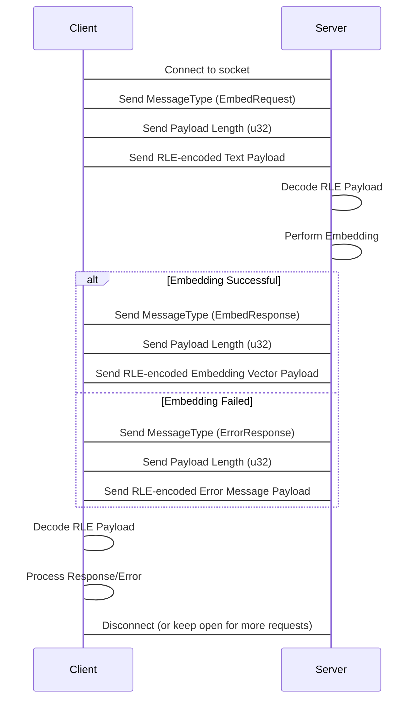

# Embedding Socket Server Documentation

This document provides comprehensive documentation for the Zage embedding socket server and its test client.

## 1. Overview

The embedding socket server is a component of the Zage project designed to provide text embedding services via a Unix domain socket. It allows other processes to request embedding vectors for given text inputs without needing to load the embedding model themselves.

Key features:

* Uses a Unix domain socket for inter-process communication.
* Employs a thread pool to handle concurrent embedding requests efficiently.
* Utilizes a custom Run-Length Encoding (RLE) protocol for compact data transfer.

The server is particularly useful for scenarios where multiple clients or processes require embedding services from a single, shared model instance.

## 2. Server Usage

The embedding socket server is included as a binary within the Zage project.

To start the server, navigate to the Zage project root directory in your terminal and run the following command:

```bash
cargo run --bin zage -- server [OPTIONS]
```

**Options:**

* `--device <DEVICE>`: Specifies the device to use for the embedding model. Common values include `cpu`. (Note: Support for other devices like `gpu` depends on the underlying embedding model implementation and available hardware.)

**Example:**

To start the server using the CPU:

```bash
cargo run --bin zage -- server --device cpu
```

By default, the server will listen on the Unix domain socket located at `/tmp/zage_embedder.sock`. The default configuration also sets the number of worker threads to 4 and a connection timeout of 30 seconds. These defaults are defined in the `ServerConfig` struct in [`src/socket_server/mod.rs`](src/socket_server/mod.rs:58).

If the socket file already exists when the server starts, it will be removed before creating a new one.

## 3. Client Usage

The `test_embedding_client` is a command-line utility for interacting with the running embedding socket server. It can be used to send single embedding requests or run benchmarks.

To use the client, navigate to the Zage project root directory in your terminal and run the following command:

```bash
cargo run --bin test_embedding_client [OPTIONS]
```

**Options:**

* `-s, --socket-path <SOCKET_PATH>`: Path to the Unix domain socket. Defaults to `/tmp/zage_embedder.sock`.
* `-t, --text <TEXT>`: The text string to send to the server for embedding. Required when not in benchmark mode.
* `-b, --benchmark`: Enable benchmark mode.
* `-n, --num-requests <NUM_REQUESTS>`: The number of embedding requests to send in benchmark mode. Defaults to 100.
* `--bench-text <BENCH_TEXT>`: The text string to use for embedding requests in benchmark mode. Defaults to "Hello, world!".
* `-v, --verbose`: Show the full embedding vector in the output for single requests.

**Examples:**

Send a single embedding request for the text "Hello, server!":

```bash
cargo run --bin test_embedding_client --text "Hello, server!"
```

Run a benchmark with 500 requests using the default benchmark text:

```bash
cargo run --bin test_embedding_client --benchmark --num-requests 500
```

Run a benchmark with 1000 requests using a custom text string:

```bash
cargo run --bin test_embedding_client --benchmark --num-requests 1000 --bench-text "This is a longer text for benchmarking."
```

Send a single request and display the full embedding vector:

```bash
cargo run --bin test_embedding_client --text "Show me the vector" --verbose
```

## 4. Protocol Specification (RLE)

Communication between the client and server occurs over a Unix domain socket using a simple Run-Length Encoding (RLE) based protocol.

Each message consists of three parts:

1.  **Message Type (1 byte):** Indicates the type of message being sent.
2.  **Payload Length (4 bytes, little-endian u32):** The size of the RLE-encoded payload in bytes.
3.  **RLE-encoded Payload (variable length):** The actual message data, encoded using RLE.

### Message Types

| Value (Hex) | Value (Decimal) | Type            | Description                                | Payload Content           |
| :---------- | :-------------- | :-------------- | :----------------------------------------- | :------------------------ |
| `0x01`      | 1               | `EmbedRequest`  | Client requests an embedding for text.     | RLE-encoded text string   |
| `0x02`      | 2               | `EmbedResponse` | Server responds with the embedding vector. | RLE-encoded f32 vector    |
| `0xFF`      | 255             | `ErrorResponse` | Server indicates an error occurred.        | RLE-encoded error message |

### RLE Encoding

The RLE encoding is applied to the payload data (text string bytes or f32 vector bytes). It works by replacing sequences of identical bytes with a count and the byte value.

A run of identical bytes is encoded as two bytes:
* The first byte is the run length (1 to 255).
* The second byte is the value of the repeated byte.

If a sequence of identical bytes is longer than 255, it is broken down into multiple runs of maximum length 255, followed by a run for the remaining bytes.

**Encoding Strings:**

Text strings are first converted to UTF-8 byte sequences and then RLE-encoded.

**Encoding f32 Vectors:**

Vectors of `f32` values are converted to byte sequences by representing each `f32` as 4 bytes in little-endian format. This byte sequence is then RLE-encoded.

### Protocol Flow



## 5. Performance Considerations

Several factors can influence the performance of the embedding socket server:

* **Device Selection:** The `--device` option significantly impacts performance. Using a GPU (if supported and available) will generally be much faster than using the CPU for embedding calculations, especially for larger models or higher throughput.
* **Thread Pool Size:** The `num_threads` configuration (defaulting to 4) determines how many client connections the server can process concurrently. An optimal thread pool size is typically related to the number of available CPU cores. Setting it too low can create a bottleneck, while setting it too high might lead to excessive context switching overhead.
* **Embedding Model Performance:** The speed of the underlying `PretrainedEmbedder` is the primary factor in how quickly individual requests are processed.

## 6. Ensuring Reliable Operation and a Single Instance

To ensure the Zage embedding server runs reliably in the background and that only one instance is active per user, you can configure it as a system service. This also allows the server to start automatically (e.g., on login) and restart if it crashes.

The server attempts to remove any pre-existing socket file at its configured path (default: `/tmp/zage_embedder.sock`) before binding to it. This behavior is the primary mechanism for ensuring that only one instance of the server is actively listening on the socket. For enhanced reliability, such as automatic restarts and startup on login, using a service manager as described below is recommended.

### Running as a Service on macOS (launchd)

On macOS, you can use `launchd` to manage the server. Create a `.plist` file, for example, named `com.yourusername.zage.embedder.plist` (replace `yourusername` with your actual username or a suitable identifier) in `~/Library/LaunchAgents/`.

**Example `com.yourusername.zage.embedder.plist`:**

```xml
<?xml version="1.0" encoding="UTF-8"?>
<!DOCTYPE plist PUBLIC "-//Apple//DTD PLIST 1.0//EN" "http://www.apple.com/DTDs/PropertyList-1.0.dtd">
<plist version="1.0">
<dict>
    <key>Label</key>
    <string>com.yourusername.zage.embedder</string>
    <key>ProgramArguments</key>
    <array>
        <string>/path/to/your/zage/target/release/zage</string>
        <string>server</string>
        <string>--device</string>
        <string>cpu</string>
        <!-- Add other arguments like --socket-path if not using default -->
    </array>
    <key>RunAtLoad</key>
    <true/>
    <key>KeepAlive</key>
    <dict>
        <key>SuccessfulExit</key>
        <false/>
    </dict>
    <key>StandardOutPath</key>
    <string>/tmp/zage_embedder.log</string> <!-- Or a path in ~/Library/Logs/ -->
    <key>StandardErrorPath</key>
    <string>/tmp/zage_embedder.err.log</string> <!-- Or a path in ~/Library/Logs/ -->
    <!-- Optional: Set WorkingDirectory if your application needs it -->
    <!-- <key>WorkingDirectory</key>
    <string>/path/to/your/zage/project</string> -->
</dict>
</plist>
```

**Instructions:**

1. Replace `/path/to/your/zage/target/release/zage` with the actual absolute path to your compiled Zage binary.
2. Save the file as `~/Library/LaunchAgents/com.yourusername.zage.embedder.plist`.
3. Load and start the service:

    ```bash
    launchctl load ~/Library/LaunchAgents/com.yourusername.zage.embedder.plist
    launchctl start com.yourusername.zage.embedder
    ```

To unload: `launchctl unload ~/Library/LaunchAgents/com.yourusername.zage.embedder.plist`

### Running as a Service on Linux (systemd)

On Linux systems using `systemd`, you can create a user service file. Create a file named `zage-embedder.service` in `~/.config/systemd/user/`.

**Example `zage-embedder.service`:**

```ini
[Unit]
Description=Zage Embedding Socket Server
After=network.target

[Service]
Type=simple
ExecStart=/path/to/your/zage/target/release/zage server --device cpu
# Add other arguments like --socket-path if not using default
Restart=on-failure
RestartSec=5s
# Optional: Set WorkingDirectory if your application needs it
# WorkingDirectory=/path/to/your/zage/project

[Install]
WantedBy=default.target
```

**Instructions:**

1. Replace `/path/to/your/zage/target/release/zage` with the actual absolute path to your compiled Zage binary.
2. Save the file as `~/.config/systemd/user/zage-embedder.service`.
3. Reload systemd, enable, and start the service:

    ```bash
    systemctl --user daemon-reload
    systemctl --user enable --now zage-embedder.service
    ```

To check status: `systemctl --user status zage-embedder.service`

To stop: `systemctl --user stop zage-embedder.service`

By using these service configurations, the Zage embedding server will be managed by the system, ensuring it's running when needed. The server's own logic for handling the socket file helps ensure that only one instance is active for your user account.

## 7. Troubleshooting

Here are some common issues you might encounter and their potential solutions:

* **Server fails to start because the socket file exists:**
  * **Issue:** Error message indicating the socket file (`/tmp/zage_embedder.sock` by default) already exists and is in use by another process, or was left over from an improper shutdown.
  * **Solution:** The server attempts to remove the old socket file. If this fails, ensure no other instance is running. If you're certain no other instance is running, you might manually remove the socket file using `rm /tmp/zage_embedder.sock` before starting the server.
* **Client fails to connect to the socket:**
  * **Issue:** Client reports a connection error.
  * **Solution:**
    * Ensure the server is running.
    * Verify that the `--socket-path` used by the client matches the path the server is listening on (default is `/tmp/zage_embedder.sock`).
    * Check file permissions for the socket file. The server attempts to set permissions to `0o666`, but ensure the user running the client has read/write access.
* **Requests time out:**
  * **Issue:** Client reports a timeout error.
  * **Solution:**
    * The server might be overloaded. Consider increasing the number of worker threads (`num_threads`) or using a more powerful device (`--device`).
    * The embedding process for the given text might be taking longer than the configured `timeout_secs`.
* **Client receives an `ErrorResponse`:**
  * **Issue:** The server sends an error message instead of an embedding vector.
  * **Solution:** Examine the error message received by the client for details. This usually indicates an issue during the embedding process itself (e.g., invalid input for the model).
* **Unexpected message type or RLE decoding errors:**
  * **Issue:** Client or server reports errors related to message types or RLE decoding.
  * **Solution:** This suggests a mismatch in the protocol implementation between the client and server. Ensure both are using compatible versions and adhering strictly to the RLE protocol specification described above.

If you encounter other issues, reviewing the server and client logs (if enabled) can provide more detailed diagnostic information.
